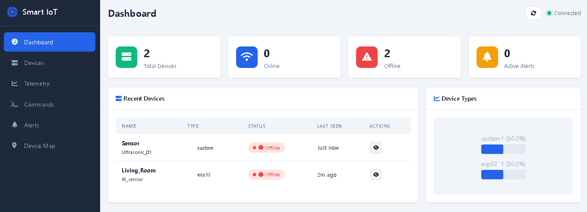
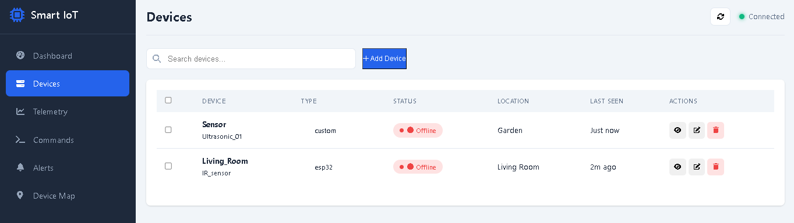

# Smart IoT Device Manager

Smart IoT Device Manager platform built with **Node.js**, **Express**, and **MongoDB**. 
Integrating with **ESP32** and other IoT devices via **MQTT** and **WebSocket** protocols.

## Features

### Core Features
- **Device Management** - Register, monitor, and control IoT devices
- **Remote Commands** - Send commands to devices (reboot, LED control, etc.)
- **Alert System** - Threshold-based alerts and notifications
- **Device Mapping** - GPS location tracking
- **Dashboard Analytics** - Visual statistics and charts
- **User Authentication** - secure auth with role management
- **WebSocket** - Real-time communication
- **MQTT Integration** - ESP32-compatible MQTT broker support

### Dashboard


### Devices


### ESP32
- Auto device registration
- Deep sleep & power management
- WiFi signal strength monitoring
- Sensor calibration support


### Prerequisites
- Node.js 
- MongoDB 5.0+
- esp32

### Install Dependencies
```bash
npm install
```

### Configure Environment
```bash
cp .env .env.local
# Edit .env.local with settings
```

### Run the Server
```bash
npm run dev
# or
npm start
```

### Access the Dashboard
- http://localhost:3000

## API Endpoints

### Authentication
| Method | Endpoint | Description |
|--------|----------|-------------|
| POST | `/api/auth/register` | Register new user |
| POST | `/api/auth/login` | Login |
| GET | `/api/auth/me` | Get current user |
| PUT | `/api/auth/password` | Update password |
| POST | `/api/auth/logout` | Logout |

### Devices
| Method | Endpoint | Description |
|--------|----------|-------------|
| GET | `/api/devices` | List all devices |
| GET | `/api/devices/:id` | Get device details |
| POST | `/api/devices` | Create device |
| PUT | `/api/devices/:id` | Update device |
| DELETE | `/api/devices/:id` | Delete device |
| POST | `/api/devices/:id/command` | Send command |
| GET | `/api/devices/:id/telemetry` | Get telemetry |
| GET | `/api/devices/:id/stats` | Get statistics |
| GET | `/api/devices/dashboard/summary` | Dashboard data |
| PUT | `/api/devices/bulk/update` | Bulk update |

### Telemetry
| Method | Endpoint | Description |
|--------|----------|-------------|
| GET | `/api/telemetry` | All telemetry |
| POST | `/api/telemetry` | Record telemetry |
| GET | `/api/telemetry/device/:id` | Device telemetry |
| GET | `/api/telemetry/latest/:id` | Latest reading |
| GET | `/api/telemetry/stats/:id` | Statistics |
| DELETE | `/api/telemetry/cleanup` | Cleanup old data |

### Commands
| Method | Endpoint | Description |
|--------|----------|-------------|
| GET | `/api/commands` | List commands |
| POST | `/api/commands` | Send command |
| GET | `/api/commands/:id` | Get command |
| PUT | `/api/commands/:id/status` | Update status |
| POST | `/api/commands/:id/retry` | Retry command |
| DELETE | `/api/commands/:id` | Delete command |

### Users (Admin)
| Method | Endpoint | Description |
|--------|----------|-------------|
| GET | `/api/users` | List users |
| GET | `/api/users/:id` | Get user |
| PUT | `/api/users/:id` | Update user |
| DELETE | `/api/users/:id` | Delete user |
| GET | `/api/users/profile/me` | My profile |
| PUT | `/api/users/profile/me` | Update profile |

## ESP32 Integration

### Supported Commands
- `reboot` - Restart device
- `led_on` / `led_off` / `led_blink` - LED control
- `relay_on` / `relay_off` / `relay_toggle` - Relay control
- `sleep` / `wake` - Power management
- `get_status` / `get_config` - Device info
- `update_config` - Configuration update
- `factory_reset` - Reset to defaults
- `calibrate` - Sensor calibration

## Security Features

- JWT token authentication
- Password hashing with bcrypt (salt rounds: 12)
- Role-based access control (admin, user, viewer)
- Rate limiting (100 requests per 15 minutes)

## Dependencies

| Package | Purpose |
|---------|---------|
| express | Web framework |
| mongoose | MongoDB ODM |
| bcryptjs | Password hashing |
| jsonwebtoken | JWT authentication |
| mqtt | MQTT client |
| ws | WebSocket server |
| dotenv | Environment variables |
| cors | CORS middleware |
| helmet | Security headers |
| express-rate-limit | Rate limiting |
| morgan | HTTP logging |
| express-validator | Input validation |

## License

This project is developed for educational and research purposes only.
All Rights Reserved.
